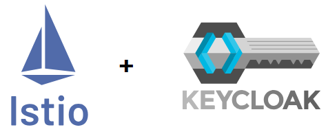
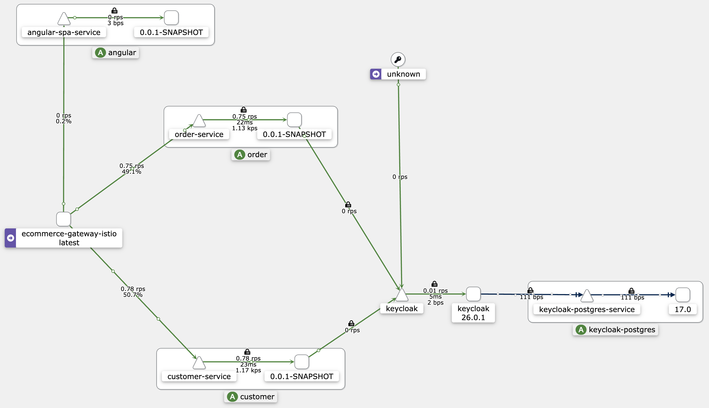
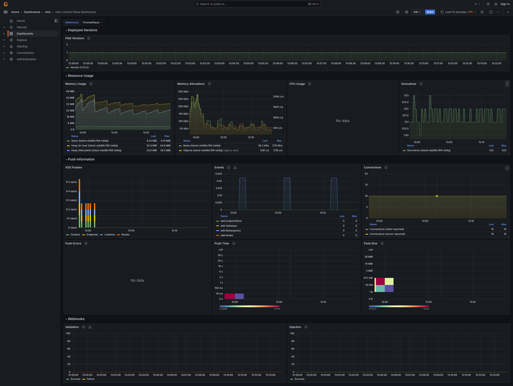
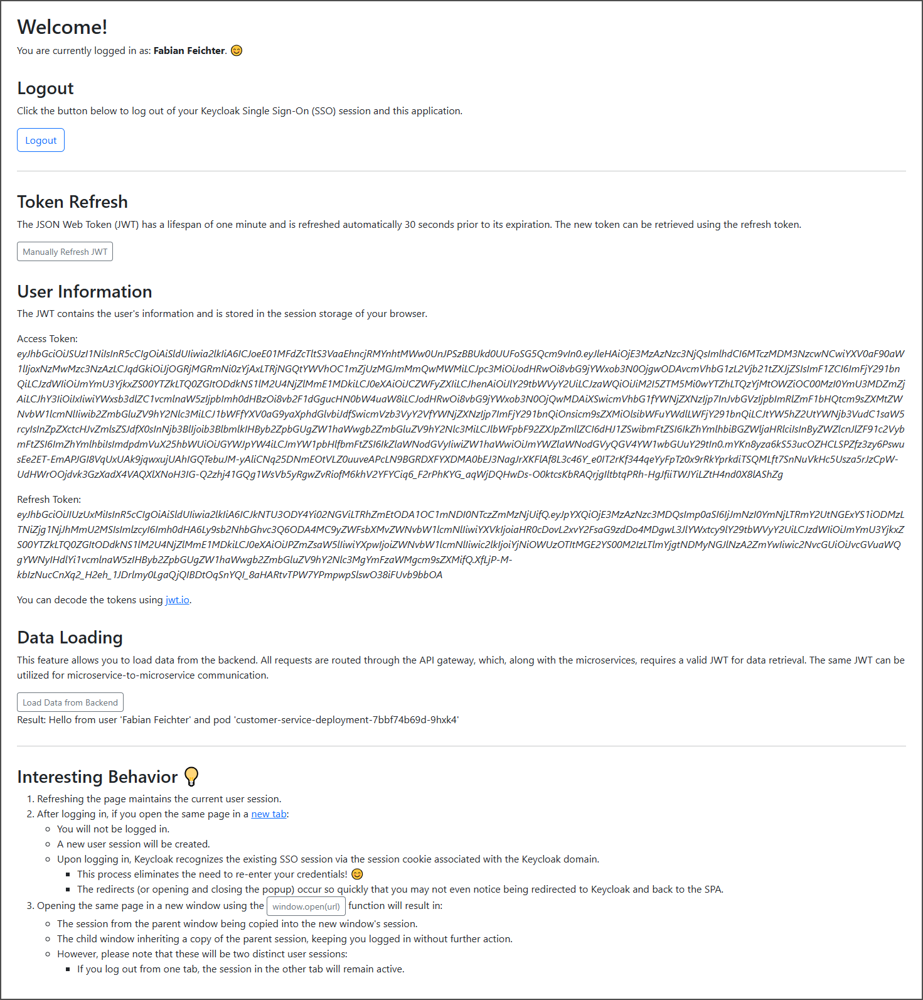
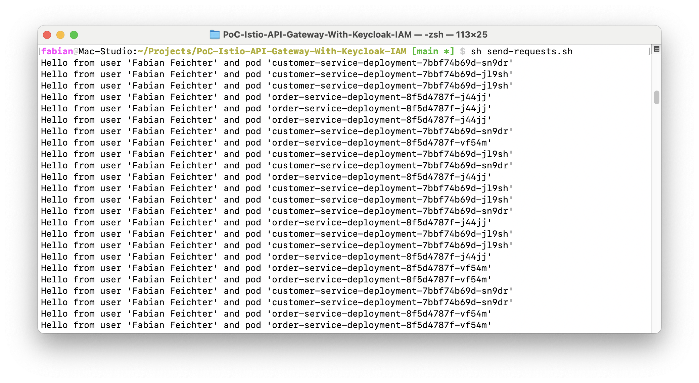

# PoC - Istio API Gateway with Keycloak IAM



This **proof of concept** (PoC) demonstrates an **API Gateway** integrated into a **service mesh** using
[**Istio**](https://istio.io/), with [**Keycloak**](https://www.keycloak.org/) as a **centralized identity and access
management** (IAM) solution.

## Architecture

The PoC consists of the following base components:

| Component                 | Description                                                        | OAuth Role           |
|:--------------------------|:-------------------------------------------------------------------|----------------------|
| **Customer Microservice** | Provides customer data.                                            | Resource Server      |
| **Order Microservice**    | Provides order data.                                               | Resource Server      |
| **API Gateway**           | Routes requests to the microservices.                              | Resource Server      |
| **SPA Frontend**          | A simple Angular frontend to access the API Gateway.               | Client               |
| **IAM**                   | Keycloak as a central Identity and Access Management (IAM) system. | Authorization Server |

The technology of interest is **Istio**, a robust service mesh that provides an extensive array of **features**,
including:

- **Service Discovery**
- **Load Balancing**
- **Rate Limiting**
- **Security**

Additionally, Istio offers an implementation of the [**Kubernetes Gateway API**](https://gateway-api.sigs.k8s.io/),
enabling us to define the API Gateway in a **consistent and standardized** way within **Kubernetes** (K8s) environments.
This design facilitates the potential replacement of Istio with another
[**Kubernetes Gateway API implementation**](https://gateway-api.sigs.k8s.io/implementations/) without necessitating
changes to the API Gateway configuration.



The following **tools** are used to collect and visualize **telemetry data** from Istio and the services:

- **Kiali**: A tool for _visualizing_ telemetry data.
- **Jaeger**: A tool for request _tracing_.
- **Prometheus**: A _monitoring_ tool for services.
- **Grafana**: A tool for _visualizing_ monitoring data.
- **Zipkin**: Another tool for request _tracing_.

## Setup

### Install Tools

To run the PoC, we need to install several **tools**:

- **Minikube**:
  [Get Started!](https://minikube.sigs.k8s.io/docs/start/?arch=%2Flinux%2Fx86-64%2Fstable%2Fdebian+package)
- **kubectl**:
  [Install and Set Up kubectl on Linux](https://kubernetes.io/docs/tasks/tools/install-kubectl-linux/#install-using-native-package-management)
- **istioctl**:
  [Download Istio](https://istio.io/latest/docs/setup/getting-started/#download)

### Build

We need to build the **Docker images** for:

- the **Spring Boot** microservices
- and the **Angular** frontend.

You can build the images by running the following script:

```bash
sh build.sh
```

### Optional: Visualize Telemetry Data

You can visualize telemetry data using [**Kiali**](https://kiali.io/) and/or [**Grafana**](https://grafana.com/).

Both scripts below will also deploy all necessary tools for collecting telemetry data, including
[**Jaeger**](https://www.jaegertracing.io/docs/latest/operator/). We used the **official Istio demo as** a reference for
the telemetry setup - you can find more information in the
Istio [**Sample Addons**](https://github.com/istio/istio/tree/release-1.23/samples/addons).

#### Kiali

To start Kiali, run the following script:

```bash
sh kiali.sh
```

The application runs on [**http://localhost:20001**](http://localhost:20001).

#### Grafana

To start Grafana, run the following script:

```bash
sh grafana.sh
```

The application runs on [**http://localhost:3000**](http://localhost:3000).



### Start the Cluster

We can now start the **Kubernetes cluster** by executing the following command:

```bash
sh start-cluster.sh
```

## Use the Cluster

Finally, we are able to use the cluster. You can access the **Angular** frontend at
[**http://localhost:4000**](http://localhost:4000).

Username: **fabian**\
Password: **fabian**



We can make **requests** to the gateway using the following **endpoints**:

- **http://localhost:4000/api/v1/customers/1**: This endpoint routes to the **customer microservice** and retrieves
  customer information.
- **http://localhost:4000/api/v1/order/1**: This endpoint routes to the **order microservice** and retrieves order
  information.

All endpoints are secured by OAuth, so ensure you pass a valid **JWT**. You can use **Postman** (see the Postman
collection file `ecommerce_collection` in the root of this repository) or the following **script** to send requests:

```bash
sh send-requests.sh
```

